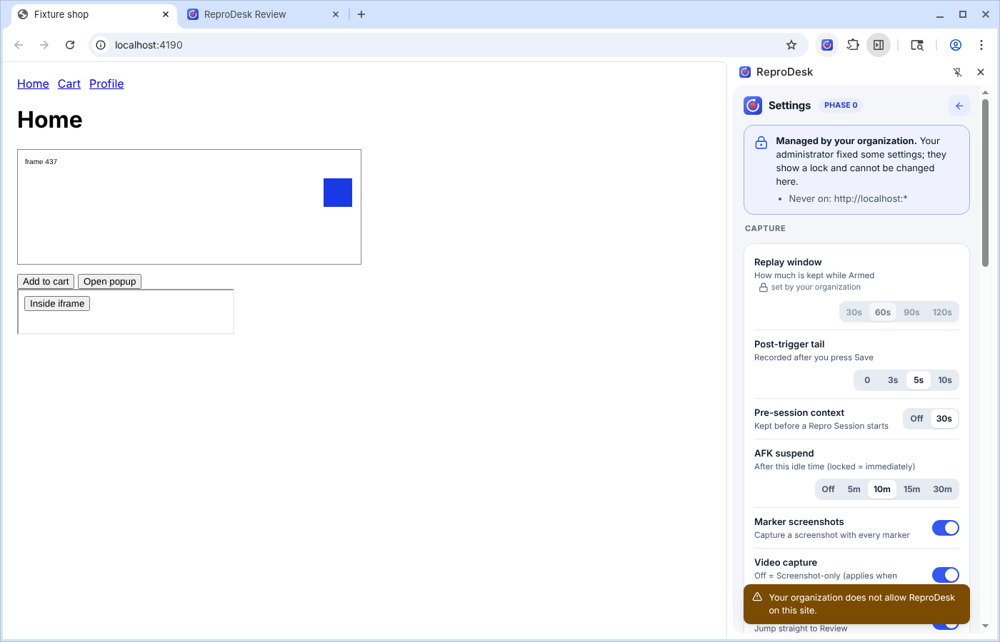
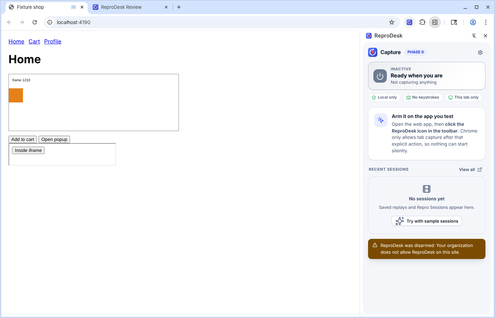

# ReproDesk - administrator policies

ReproDesk reads its enterprise controls from the browser's own policy channel (Chrome / Edge **managed storage**), the same mechanism as Group Policy,
Intune, a configuration profile or a JSON file. Nothing is configured in the extension itself, nothing is sent anywhere, and users cannot override it.



## 1. What you can control

| Policy | Type | Effect | What the user sees |
|---|---|---|---|
| `AllowedTargetOrigins` | list of origin patterns | If set, ReproDesk can only be armed on matching sites (including switching the capture to another tab). | Arming elsewhere is refused with "Your organization allows ReproDesk only on approved sites"; the list is shown on the idle card and in Settings. |
| `BlockedOrigins` | list of origin patterns | ReproDesk never runs on matching sites. **Wins over** the allow-list. A capture already running on a site that becomes blocked is stopped at once (disarmed, with a system event in the timeline). | "Your organization does not allow ReproDesk on this site" / "ReproDesk was disarmed: ..." |
| `ApprovedOrigins` | list of plain origins | Added to every user's approved scope (e.g. your SSO or payment domain), on top of what the user adds. Blocked origins are never approved. | Shown as "Added by your organization". |
| `ReplayWindowSec` | 30 / 60 / 90 / 120 | Fixes the Instant Replay window. | Control disabled, lock icon. |
| `PostTriggerTailSec` | 0 / 3 / 5 / 10 | Fixes the post-trigger tail. | Locked. |
| `PreSessionContextSec` | 0 / 30 | Fixes the pre-session context. | Locked. |
| `AfkAutoPauseMinutes` | 0 / 5 / 10 / 15 / 30 | Fixes AFK auto-pause (0 = off). | Locked. |
| `MarkerScreenshots` | true / false | Fixes "screenshot with every marker". | Locked. |
| `VideoCaptureAllowed` | true / false | `false` forbids video: ReproDesk then only offers **Screenshot-only** mode, whatever the user chose. `true` merely means "not forbidden". | Video switch locked off, "Forbidden: Screenshot-only mode". |
| `EnvironmentLabel` | text | Environment name written into every report (e.g. "QA staging"). | Locked. |
| `AllowedExportFormats` | subset of `zip`, `html`, `docx`, `xlsx`, `txt`, `md` | Only these formats are offered; the Markdown / Text copy buttons follow `md` / `txt`. A list that names no known format turns exporting **off**. | Other formats are missing; "Export options are set by your organization." |
| `AllowUnredactedOriginals` | true / false | `false` removes the "include original screenshots" switch: unredacted originals can never leave the device. Redacted copies are unaffected. | Switch missing. |
| `RequireExportConfirmation` | true / false | Every export and every copy-to-clipboard first asks the user to confirm that visible sensitive data was checked and hidden. Declining exports nothing. | Confirmation dialog. |
| `SessionRetentionDays` | 0 - 3650 | Finished sessions older than N days are deleted with their video, screenshots, events and reports. 0 = keep. Runs at browser start and hourly; never touches an active session. | Sessions disappear after the period. |
| `SampleSessionsEnabled` | true / false | `false` hides the bundled sample sessions and refuses to load them. | No "Sample data" section. |

**Origin patterns** are `scheme://host[:port]`:
* scheme: `https`, `http` or `*`;
* host: exact (`app.example.com`), `*.example.com` (the domain **and** every subdomain) or `*`;
* port: a number, or `*`. **No port means the scheme's default port only** - `http://localhost` does *not* match `localhost:5173`; write `http://localhost:*`.

Fail-closed rules: an allow-list whose patterns are all invalid allows nothing; `AllowedExportFormats` with no known format allows nothing; an origin that is blocked is never part of the approved scope, so even an already-armed tab on it pauses.

Policy values always win over the user's own settings. The user's own values are kept untouched underneath and come back if the policy is removed.

## 2. Generate the deployment files

```bash
cd extension
cp policy/example-policy.json my-policy.json      # edit
node scripts/gen-policy.mjs my-policy.json --id <extension id> --out policy/out [--update-url <url>]
```

The generator validates the policy first (unknown names, bad patterns, out-of-range values are listed in plain words) and writes:

| File | Use |
|---|---|
| `chrome-linux.json` | `/etc/opt/chrome/policies/managed/reprodesk.json` (Chromium: `/etc/chromium/policies/managed/`) |
| `chrome-windows.reg`, `edge-windows.reg` | Registry values under `HKLM\SOFTWARE\Policies\Google\Chrome\3rdparty\extensions\<id>\policy` (Edge: `...\Microsoft\Edge\...`). Import for a pilot, or deploy the same keys through Group Policy Preferences / your endpoint tool. |
| `chrome-macos.plist`, `edge-macos.plist` | Payload for a configuration profile / Managed Preferences (`com.google.Chrome`, `com.microsoft.Edge`). |
| `extension-settings.json` | The `ExtensionSettings` policy that force-installs ReproDesk and pins its toolbar icon. |

The extension id of an unpacked development install is always `fnjljfngnjfnijhpocjnigkmhobjpggf`. A Chrome Web Store / Edge Add-ons release has its own id: pass it with `--id`.

### Windows (Group Policy / Intune)
1. Roll out the extension with `ExtensionSettings` (`extension-settings.json`; Chrome ADMX: *Configure extension management settings*; Edge: same name).
2. Deploy the policy values to `HKLM\SOFTWARE\Policies\Google\Chrome\3rdparty\extensions\<id>\policy` (array policies are sub-keys with values `1`, `2`, ...). Chrome's ADMX has no editor for third-party extension values, so use Group Policy Preferences > Registry, or in Intune a script / Win32 app that applies the generated `.reg`.

### macOS
Add the generated plist content as a Custom Settings payload for `com.google.Chrome` (or `com.microsoft.Edge`) in your MDM, next to the `ExtensionSettings` value.

### Linux
Copy `chrome-linux.json` (and merge `extension-settings.json` into your existing `ExtensionSettings`) to the managed policy directory. Chrome watches the directory: changes apply without a restart.

### Extra Chrome-level controls worth setting
* `ExtensionSettings` > `toolbar_pin: force_pinned` (the generated snippet) so users can find the icon.
* `ExtensionSettings` > `runtime_blocked_hosts` for the same sites as `BlockedOrigins`: a Chrome-level block of extension access to those hosts, independent of ReproDesk (not exercised here - test its effect on the toolbar-click flow on a pilot machine).
* ReproDesk needs no host permission to arm (it uses the toolbar click, `activeTab`). "Remember this site" asks the user for one optional host permission; `runtime_blocked_hosts` still applies to it.

## 3. Check that it works

1. `chrome://policy` > *Reload policies*: the extension's policies are listed under the extension's name. A value that does not fit the schema is reported there as an error.
2. Open the ReproDesk side panel > Settings: the **Managed by your organization** banner lists the rules and locked controls carry a lock. *Diagnostics > Copy diagnostics JSON* contains a `policy` block (what is active and which settings are locked) - useful in support tickets.
3. Click the toolbar icon on a blocked site: nothing arms, the panel explains why.



## 4. What was verified, and what was not

* **Real policy channel, real Chromium (Linux):** a managed-policy JSON file produced by `gen-policy.mjs` is delivered to `chrome.storage.managed` (schema accepted, values typed correctly); a genuine toolbar click on a blocked site does not arm; changing the file while the browser runs is picked up without a restart; tightening the policy under a running capture disarms it and tells the user (`npm run test:real`, suite `real-policy`, 12 checks).
* **Enforcement logic, headless (31 checks) and unit (24 + 7 checks):** every policy above, fail-closed rules, locked UI, accessibility of the managed UI in light and dark themes, retention, export controls with the confirmation dialog.
* **Not run here:** official Google Chrome, Windows registry / GPO / Intune delivery, macOS profiles and Microsoft Edge. The `.reg` and `.plist` files follow Chrome's documented layout for third-party extension policy, but nobody has loaded them yet - validate on one pilot machine with `chrome://policy` before rolling out.
* **Limits by design:** policy is per browser profile on the device; there is no central reporting or remote control; it cannot grant host permissions; it changes nothing that was already exported.
